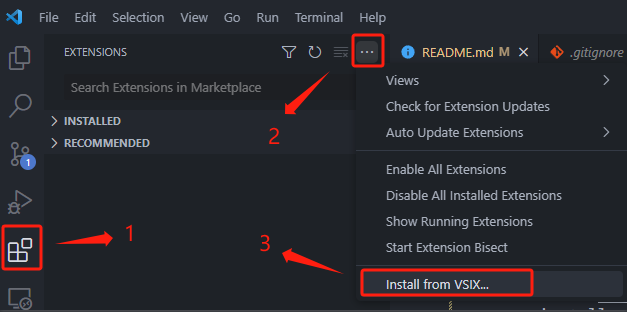

# Shiyan Snippets

## Require
vscode version: >= 1.84.0  
node version: >= 18.15.0

## How to import vscode?
1. git clone https://github.com/cyan0714/vscode-plugin-snippets.git
2. npm install @vscode/vsce -g
3. excute `vsce package` in terminal, it will generate *.vsix in project
4. import the *.vsix to vscode  

